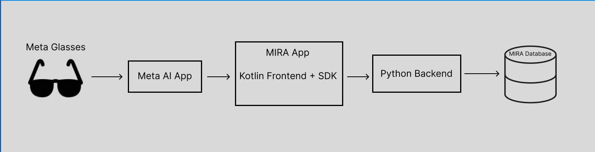
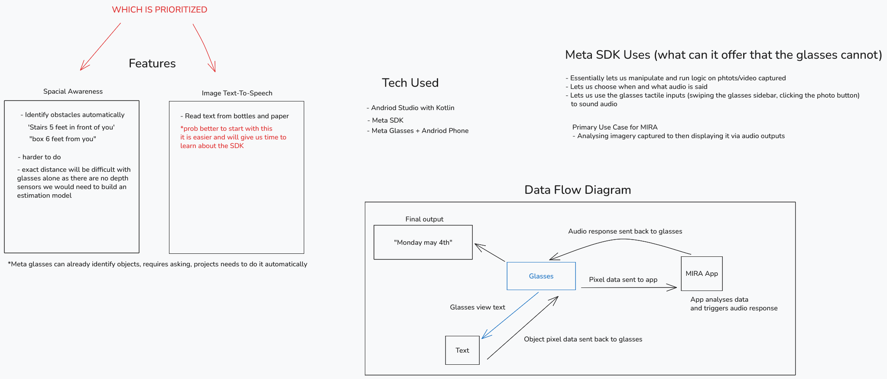

# Meta Wearable Device Access Toolkit (DAT / SDK)
*Research by josephiii*

---

## MIRA System Architecture



### Tech Stack

- **Android Studio** with Kotlin (frontend)
- **Meta SDK** (embedded in the Kotlin app)
- **Meta Glasses** + Android Phone
- **Python Backend**
- **MIRA Database**

### Pipeline Overview

```
Meta Glasses → Meta AI App → MIRA App (Kotlin Frontend + SDK) → Python Backend → MIRA Database
```

The Meta AI App sits **between** the glasses and MIRA, acting as a broker. The glasses never communicate with MIRA directly — MIRA has no direct access to them. The Meta AI App is what pairs with the glasses and "holds the keys." When MIRA needs camera data, it sends a request to the Meta AI App, which grants permission and sends pixel data back.

---

## The Meta SDK: Role and Function

The SDK lives **inside the Kotlin app** and acts as a translator — it knows the "language" required to communicate with the Meta AI App. Without it, there would be no way to make valid requests to the glasses.

It is similar to an API, with one key distinction: because the Meta AI App already lives on the user's phone, **camera and audio data stays local**. There is no round trip to a Meta server. The only potential server contact is a one-time registration check that confirms MIRA is a legitimate app.

### What the SDK enables (that the glasses alone cannot):

- Manipulate and run logic on photos/video captured by the glasses
- Choose **when** and **what** audio is played
- Use the glasses' tactile inputs (swiping the temple arm, clicking the photo button) to trigger audio

### Primary Use Case for MIRA

Analyzing imagery captured by the glasses and then delivering the result via audio output.

---

## Data Flow

```
Glasses → [pixel data] → MIRA App → [app analyses data, triggers audio response]
                                          ↓
                              Audio response sent back to Glasses
                                          ↓
                                    Final Output
                              e.g. "Monday, May 4th"
```

For text recognition specifically:
```
Glasses view text → [object pixel data sent back to glasses] → Text → [processed] → Final Output
```

---

## Features: Priority Decision

Two main features were considered. **Image Text-to-Speech is prioritized first.**

### Image Text-to-Speech *(prioritized)*
- Read text from bottles, paper, and other physical surfaces
- Easier entry point; gives the team time to learn the SDK
- Lower technical complexity at the outset

### Spatial Awareness *(deferred)*
- Automatically identify obstacles and announce distance: e.g. *"Stairs 5 feet in front of you"*, *"Box 6 feet from you"*
- Harder to implement — the glasses have no depth sensors, so exact distance estimation would require building a custom model
- Note: Meta Glasses can already identify objects on request; the project goal is to make this happen **automatically**, without the user needing to ask

---

## Open Questions / Notes

- The registration check with Meta's servers needs further clarification — what data is transmitted and how often?
- Depth estimation model research needed before Spatial Awareness can be scoped
- Need to confirm whether the SDK exposes a stable API for all tactile inputs (temple swipe, photo button) or only a subset



